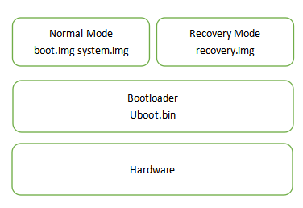

##手机的几种模式

###Android 硬件架构

###Fastboot
如上图， bootloader是支持交互的。 在完成硬件初始化之后没有继续启动OS, 而是停留在当前状态等待用户输入指令。
可通过下面指令或特定组合按键进入fastboot
adb reboot bootloader

###Recovery
recovery image包括kernel和Rootfs, 所以将revovery.img刷入系统后，我们就可以让手机启动起来。可以通过如下指令进入recovery模式。
adb reboot recovery

在revovery模式下，根据Rootfs的不同可以做不同的事情。 recovery有恢复和更新的意思， 在recovery模式下，可以update system。

用户正常使用Android设备时的系统，主要是包含有两个分区：System分区和Boot分区。在recovery模式下，可以刷入指定的system和boot image, 完成修改update。

一个完整的刷ROM过程，包含以下两个步骤：
让设备进入到Fastboot模式，刷入一个recovery.img镜像
让设备进入到Recovery模式，刷入一个包含system.img镜像和boot.img镜像的zip包
